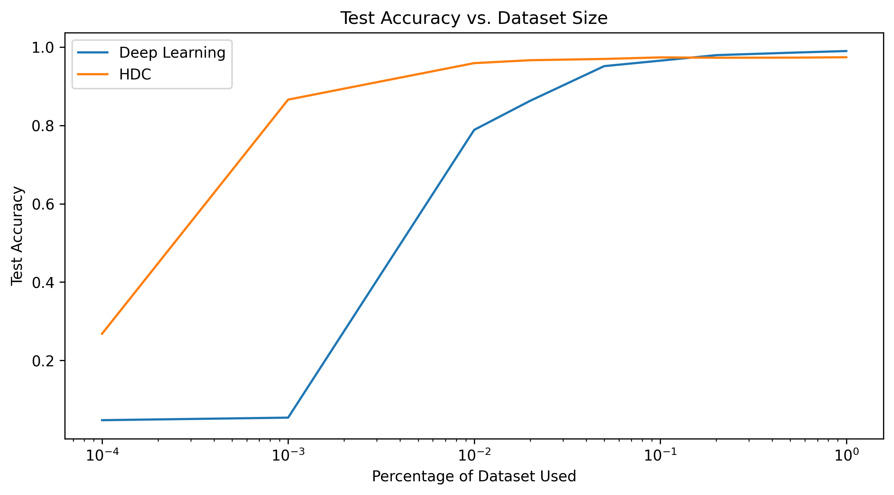
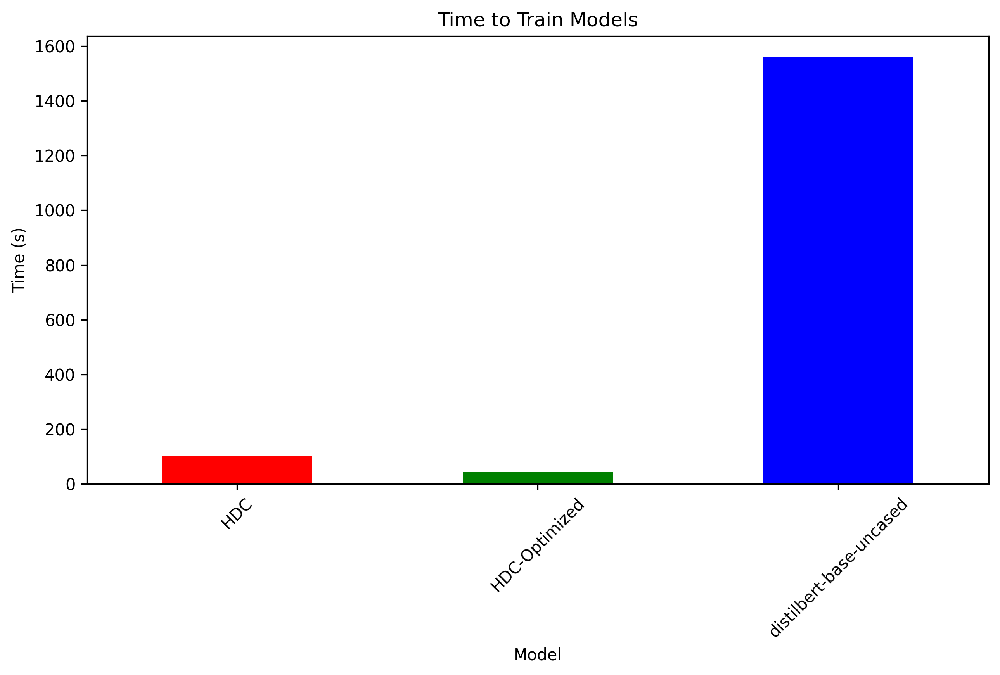
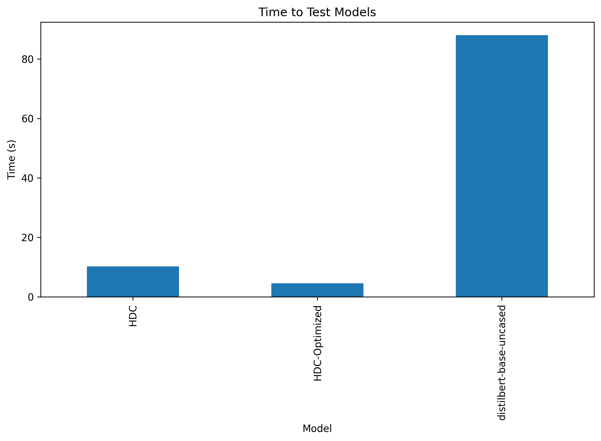
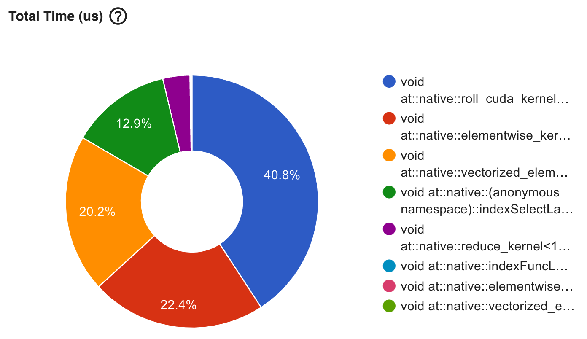
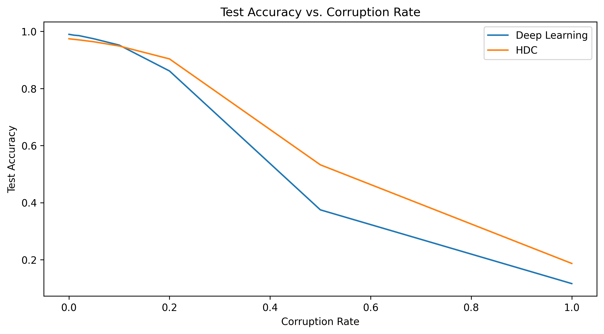

# HPML Final Project
Todd Morrill (tm3229@columbia.edu), Satyam Sharma (ss6522@columbia.edu)

## Language Identification
**Experiment description:** We developed deep learning and hyperdimensional computing (HDC) based classifiers to identify languages using the [European languages](https://torchhd.readthedocs.io/en/stable/datasets.html#torchhd.datasets.EuropeanLanguages)
dataset and compared them on several key dimensions, namely:
1. Accuracy with respect to dataset size
1. Training and inference time
1. FLOP and parameter analysis
1. Robustness to text data corruption

### Code layout
All core python modules are in the final-project directory. The key modules are as follows:
1. `args.py`: Contains the argument parser
1. `data.py`: Contains the dataset class and all data related functions
1. `deeplearning.py`: Contains the deep learning based classifier and all its experiments
1. `hdc.py`: Contains the HDC based classifier and all its experiments
1. `hdc_predict.py`: Contains a utility class to load a trained HDC model and make predictions
1. `app.py`: Contains a simple web app to demonstrate the deep learning and HDC classifier

All Python library dependencies are listed in `requirements.txt`.

### Deep Learning Approach
We used [distilbert-base-uncased](https://huggingface.co/distilbert-base-uncased) as our modeling backbone and largely followed this [guide](https://huggingface.co/docs/transformers/tasks/sequence_classification) to implement the classifier.
To run the experiments, execute the following command:
```
python -m final-project.deeplearning --deep-learning --experiment all
```

### Hyperdimensional Computing Approach
We followed the architecured in [this paper](https://iis-people.ee.ethz.ch/~arahimi/papers/ISLPED16.pdf) and use this reference implementation in [TorchHD](https://github.com/hyperdimensional-computing/torchhd/blob/main/examples/language_recognition.py).

To run the experiments, execute the following command:
```
<<<<<<< HEAD
python -m final-project.hdc --experiment all
```

## To produce Tensorboard logs and view them
Record a baseline experiment and optimized experiment with the following commands:
```
python -m final-project.hdc --experiment baseline --profiler
python -m final-project.hdc --experiment baseline --profiler --roll-matrix
```
Then run the following command to view the results:
=======
python -m final-project.deeplearning --deep-learning --experiment all
python -m final-project.hdc --experiment all
>>>>>>> af2391ed737647ac2e81986adb1e831cdc071bd9
```
tensorboard --logdir=./logs
```

## Experimental results
### Accuracy with respect to dataset size

- HDC performed significantly better under limited training with as low as 1% of the dataset.
- Deep learning does overcome HDC at around 10% of the dataset but the improvement is not significant.

### Training and inference time


- HDC was 15x faster to train than distilbert-base-uncased and HDC-optimized was 35x faster
- HDC was 8x faster to test than distilbert-base-uncased and HDC-optimized was 22x faster

#### torch.roll optimization

- We implemented a custom roll operation and observed a 2x speedup in training time

### FLOP and parameter analysis
| Model | FLOPs | Parameters |
| --- | --- | --- |
| HDC | 490,000 | 210,000
| distilbert-base-uncased | 43,135,509 | 936,371,712|
- The 210,000 HDC FLOPs correspond to the cosine similarity calculations against the 21 prototype vectors, each of which is a 10,000 dimensional vector
- The number of parameters (490,000 = 210,000 + 280,000) corresponds to the 21 prototype vectors, each of which is a 10,000 dimensional vector, plus the 28 character vectors, each of which is a 10,000 dimensional vector
- We note that the HDC model delivers performance matching the deep learning model with a fraction of the deep learning model's 43,135,509 parameters

### Robustness to text data corruption

- We see that the HDC was able to perform well under input text corruption better than deep learning
- Random character corruptions performed:
    - Insert a random character
    - Delete the character
    - Substitute the character with a random character
    - Swap the character with the next character.
